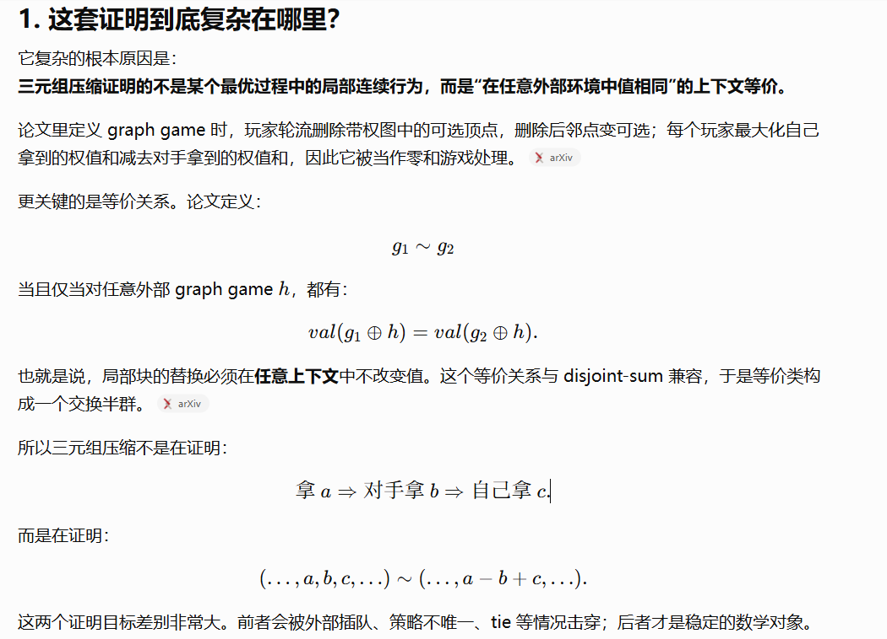

## F
根据dp数组反推答案时，一定要注意检查转移条件，不能只看dp数值的变化是否符合答案。

## J
很好的一道期望dp, [与gpt的讨论](https://chatgpt.com/c/6a2fb9db-2950-83e8-930c-9052855f5e02)

我做的时候采用了正向维护概率加权的条件期望，合并时类似于加权平均，正向做法其实也利用了 Markov 性来确定每个状态的转移概率和等待时间；但它没有把要求的量定义成 Markov 性最擅长处理的“从当前状态出发的剩余期望”，所以仍然需要处理历史路径的合并。
也没有观察到一个关键的性质：每到一个状态，它都有一个固定的期望步数离开，或者说是访问这个状态的期望步数(如果转移无状态间的环，那么这个仅依赖于自环转移概率)，如果观察到这个，就可以不维护条件期望，只维护一个转移到这个状态的概率，最后对所有状态的cost求和就行。
这个对每个状态求经过概率，并且最后**把期望拆成不同状态的贡献的和**的思路似乎也很有意思。

实际上由更好地利用Markov性的方法：从终态$(0,0,0)$逆推，定义剩余期望$F$为到达终态还剩的期望步数，用当前状态的一步正向转移写方程。
这个方法之所以可以避开不同路径概率加权，是因为在这种递推方向上，由Markov性，我并不需要关注当前状态从何转移而来，这些状态的概率是什么，而是我当前状态会以什么概率转移到哪些状态上，而这些后继态的转移概率是可以确定的，期望根据Markov性，后继态的剩余期望只与后继态本身有关，与到达后继态的历史无关，我们只需要使用恰当的顺序枚举先求出后继态即可。求解也只需要关注当前状态的一步转移概率，与历史无关。

一开始也想过min-max反演的方法，但是随后注意到每轮恰好只有$1$次操作，因此各寿司随机变量并不独立。
gpt给出了Poisson化的分析方法，但是并不适合竞赛计算与实现。
min-max 反演公式本身仍然成立，不要求独立；但原离散模型下各盘子被选次数相关，导致 $\mathbb{E}[\max_{i \in s } {T_i}]$ 不容易计算。
Poisson 化的作用是把连续时间下每个盘子的完成时间变成独立 Gamma 变量，从而让 min/max 分析更顺滑。 
Poisson化的观点我应该深度学习一下这一题和cacc D那个不放回抽样题目后，专门整理一篇，这里不多赘述。
可能需要先系统学习一些常见的概率分布函数与分析方法，才能慢慢理解这个？今天还没有搞太清楚。

有一个相关的问题可以分析，$n$ 个随机变量 $X_i \sim G(p)$, $ G(p) $是取值为 $\{1, 2, \dots ,\}$的几何分布, 且彼此相互独立， 求 $\mathbb{E}[\max\limits_{i \in [n]}{X_i}]$
考虑 min-max反演， 有：
$$\begin{align*}
    \mathbb{E}[\max_{1 \leq i \leq n} {X_i}] 
    &=\sum_{\empty \neq S \subseteq [n]} (-1)^{|S| + 1} \mathbb{E}[\min_{i\in S} {X_i}] \\
    &=\sum_{k = 1}^n (-1)^{k + 1} \binom{n}{k} \mathbb{E}[\min_{i \in [k]} {X_i}]
\end{align*}$$
再考虑$\mathbb{E}[\min\limits_{i \in [k]} {X_i}]$ 的求法，直接按照定义求解， 即
$$\begin{align*}
\mathbb{E}[\min\limits_{i \in [k]} {X_i}] 
&= \sum_{i = 1}^\infty i (1-p)^{k(i - 1)}(1 - (1 - p)^k)\\
&= \sum_{i = 1}^\infty i q_k^{i - 1}(1 - q_k)\\
&= \frac{1}{1 - q_k} 
\end{align*}$$
其中$q_k = (1 - p)^k$
最后一步推导可以使用经典的几何级数求和公式，不过这个公式具体怎么推倒是记不清了(其实可以求导算)
于是有：
$$\begin{align*}
    \mathbb{E}[\max_{1 \leq i \leq n} {X_i}] 
    &=\sum_{k = 1}^n (-1)^{k + 1} \binom{n}{k} \frac{1}{1 - q_k} 
\end{align*}$$

## L
也是一道很好的博弈+dp题

### 一般思路
核心思路是建模成零和博弈模型，然后最大化 X-Y 这个指标
然后就可以考虑对 X-Y 这个量去做dp
这个dp应该是倒着进行决策的，因为我们对当前局面的选择取决于子局面的情况，那么就需要先求解子局面
考虑 $dp_{i, j}$ 的含义为左边取了$i$ 个， 右边取了 $j$ 个后， 剩下的区间可以产生的最大的 X-Y (即区间 $[i + 1, n - j]$ 的答案)
不过这个"答案"怎么定义，也是有说法的
如果我定义为对于游戏$[1, n]$先手的答案，那么需要对奇偶轮次稍微分讨一下
但是如果我定义成对于游戏$[i + 1, n - j]$先手的答案, 那么处理是统一的，且最后推出来作为答案也相当自然。(这是我在做升级版后才悟到这种对称性处理的)
dp转移式:
$$dp_{k - j,j} = \max(a_{k - j} - dp_{k - j + 1,j} , a_{n - j - 1} - dp_{k - j,j + 1})$$
倒着循环处理转移即可
最后的答案$dp[0][0]$

### 一个$O(n)$优化 
一个结论: 在这个游戏里，相邻的三元组 $a,b,c$ 如果满足 $a,c < b$ (即 $b$ 是一个局部最大值)， 那么可用把这个三元组替换成$a - b + c$, 而博弈的结果不变。
具体证明依赖一篇论文: https://arxiv.org/pdf/1509.07533

利用这个结论，我们可用把原数组压成一个 V 型数组，然后贪心选择即可。
可用做到$O(n)$的时间复杂度

### 引申题: [Ucup 1st Stage18 A. Is it well known in Poland? ](https://qoj.ac/contest/1245/problem/6514)
这题是在树上进行这个游戏，一开始根是解锁的。
具体思路仍然是倒着过来推理这个博弈过程
博弈过程可用理解为一个多分叉的栈，每次取栈顶的一个元素，然后分裂成若干个栈(其实不如就当是树来理解)
对于这样的树形博弈过程，我们希望可以用一组信息去刻画一个子树，然后通过子树信息的合并来进行dp求解
具体的做法我们直接给出来：
一个子树可以用一个候选值集合，和一个亏损值来描述。
下文的结构指的是一个点集。
亏损值对应一个偶结构，如果一个偶数点的结构选择会导致亏损，且不改变先后手关系，就可以直接压缩为它的值记录下来
候选值集合则是还不能确定是否选了会亏的奇结构的值，每选一个就会改变先后手(这里说结构的值，是因为候选值可能是压缩过的)
有没有不亏的偶结构呢？我们不这样处理，可能不亏的偶结构会被我们用多个奇结构描述。
我们合并子树信息时，按照定义时亏损值相加，候选值合并。
显然博弈时，我们会优先选择大的候选值来最大化自己的收益，那么当我们加入当前处理的树的根节点信息时，有两种情况：
1. 根节点的收益比所有候选值大， 那么我们直接加入候选值就行，此时我们会优先选择根节点，因此自然包含了根节点必须先于其他子树节点选取的限制
2. 有候选值比根节点的收益大，那么我们可以使用上文提到的三元组压缩。根据论文，这个压缩是成立的。于是我们不断选取候选值的最大和次打，进行压缩，直到转化成情况1， 或者候选值数量小于两个且不属于情况1。如果候选值数量为0，那么我们新压缩出来的值就是唯一的候选值了，如果为1， 那么相当于我选了这个压缩后的值，唯一剩下的这个候选值比我选的大，会让我亏，且选完了后先后手关系不变，那么就可以看作一个偶结构计入亏损值，而候选值集合清零。
观察上面的操作，我们需要合并两个集合，获得一个集合的最大值，往集合插入一个值。那么我们可以使用可并堆来维护候选值集合，pbds里面是有的。
最后的答案就是我们按照规则，把根节点的候选值集合按照规则计算(也就是一个交错和)，最后再判断先后手选择加上/减去亏损。

关于三元组压缩为什么在树上适用，其实也可以直观理解，但是真正证明其实挺难。压缩也不是指这3个点要一起选，而是说作替换后，**博弈在数值上仍然是等价**的。
懒得敲字了，干脆直接放图

不过也有两个引申的题，或许是不可做的。等以后AI非常强大了，交给AI去探索一下吧。
1. 考虑解锁的只有当前树的叶节点，博弈值怎么求解。
2. 探究树上点的关系: 
    a.等价关系: 如果u，v在所有最优博弈中，都被同一方选取，那么u，v等价； 
    b.互斥关系: 如果u，v在所有最优博弈中，都被不同方选取，那么u，v互斥。 
    可以看看等价类划分，互斥关系的情况，并且设计一些相关的计数问题/图论问题。
    最优博弈的定义是双方按照最佳策略进行博弈，可能出现的博弈局面。

